# Microsoft Entra ID IAM & Access Governance Lab

## Overview

This project demonstrates the redesign of a fictional organization's payroll access model using Microsoft Entra ID and Microsoft Entra Privileged Identity Management (PIM).

The original payroll process relied on a single employee to review and approve payroll. The employee's extended absence exposed a single point of failure and highlighted weaknesses in privileged access management, business continuity and access governance.

The redesigned model provides two authorized payroll approvers while reducing standing privilege and introducing independent governance controls. Privileged payroll access is managed through eligible group membership, time-limited activation, business justification and recurring access certification.

## Security Objectives

The solution was designed to:

- Eliminate the single point of failure in payroll approval
- Implement role-based access control (RBAC)
- Apply least privilege to payroll access
- Reduce standing privileged access through PIM
- Establish primary and backup payroll approvers
- Require justification for privileged access activation
- Introduce separation of duties between access users and reviewers
- Support business continuity during employee absence
- Periodically recertify privileged access through access reviews
- Maintain auditable evidence of access governance decisions

## Environment

- Microsoft Entra ID
- Microsoft Entra Privileged Identity Management (PIM)
- Microsoft Entra ID Governance
- Enterprise Applications
- Security Groups
- Access Reviews

## Architecture & Identity Design

The payroll access model separates standard application access, privileged payroll approval and governance responsibilities.

### Identity Roles

| Identity | Business Role | Access Responsibility |
|---|---|---|
| Bob Barker | Primary Payroll Approver | Eligible for privileged payroll approver access through PIM |
| Anita Adams | Backup Payroll Approver | Eligible for privileged payroll approver access through PIM |
| Casey Castigan | Payroll Manager | Reviews and certifies payroll approver access |
| Edna Edwards | Payroll User | Standard payroll application access |
| Duane Dumphrey | Standard User | No privileged payroll approval responsibility |

### Access Model

Two security groups were used to separate ordinary payroll access from privileged approval responsibilities:

- **SG-Payroll-Users** provides access to the TNWGroup Payroll System enterprise application.
- **SG-Payroll-Approvers** represents the privileged payroll approval function and is governed through Privileged Identity Management.

Bob Barker and Anita Adams are configured as **eligible**, rather than permanently active, members of SG-Payroll-Approvers. When payroll approval access is required, an eligible approver activates membership through PIM for a limited period and provides a business justification.

Casey Castigan serves as the independent reviewer for recurring access certification, separating the governance function from the employees receiving privileged access.

### Governance Flow

`Eligible Approver → PIM Activation → Time-Limited Group Membership → Payroll Approval Access → Expiration`

Recurring governance is applied separately:

`SG-Payroll-Approvers → Semi-Annual Access Review → Independent Reviewer → Approve or Deny Continued Eligibility`

## Implementation

### 1. Tenant Identity and Group Configuration

Five fictional user identities were created to represent the payroll and governance roles used throughout the lab.

Two security groups were then created to separate standard payroll application access from privileged payroll approval responsibilities:

- `SG-Payroll-Users` for standard payroll application access
- `SG-Payroll-Approvers` for privileged payroll approval access

This group-based design allows permissions to be assigned according to business function rather than directly to individual users, supporting RBAC and simplifying access administration.

### 2. Enterprise Application Access

The `TNWGroup Payroll System` enterprise application was configured to represent the organization's payroll application.

Standard payroll application access was assigned through `SG-Payroll-Users`, establishing a group-based access model rather than assigning the application directly to individual employees.

### 3. Privileged Payroll Access with PIM

`SG-Payroll-Approvers` was configured for Microsoft Entra Privileged Identity Management (PIM).

Bob Barker and Anita Adams were assigned as eligible members rather than maintaining permanent active membership. This reduces standing privileged access while preserving two authorized payroll approvers for business continuity.

PIM activation was configured to require business justification and provide access for a limited duration. An eligible approver can therefore obtain privileged payroll access when required without retaining that access continuously.

### 4. Privileged Access Activation

The PIM workflow was tested by activating eligible membership in `SG-Payroll-Approvers`.

The activation demonstrated the just-in-time access lifecycle:

`Eligible → Activation Request → Business Justification → Active Membership → Expiration`

This provides an auditable mechanism for granting privileged access only when there is a legitimate business need.

### 5. Recurring Access Certification

A semi-annual access review was created for `SG-Payroll-Approvers` to periodically verify that privileged payroll eligibility remains appropriate.

Casey Castigan, acting as Payroll Manager, was assigned as the independent reviewer. This separates privileged access usage from access certification responsibilities.

The review requires justification for access decisions and provides Microsoft Entra recommendations based on available identity activity. During testing, the reviewer evaluated both eligible payroll approvers and documented decisions regarding continued access.

This creates a recurring governance control around privileged access rather than relying solely on the original assignment decision.

## Validation & Evidence

The access model was validated through user-level testing, privileged access activation, independent approval, recurring access certification, and audit-log review.

### RBAC and Application Role Separation

The payroll enterprise application uses separate application roles for standard payroll access and privileged payroll approval.

- `SG-Payroll-Users` is assigned the **Payroll User** role.
- `SG-Payroll-Approvers` is assigned the **Payroll Approver** role.

This separates ordinary payroll access from approval authority and allows permissions to be managed through security groups rather than direct user assignments.

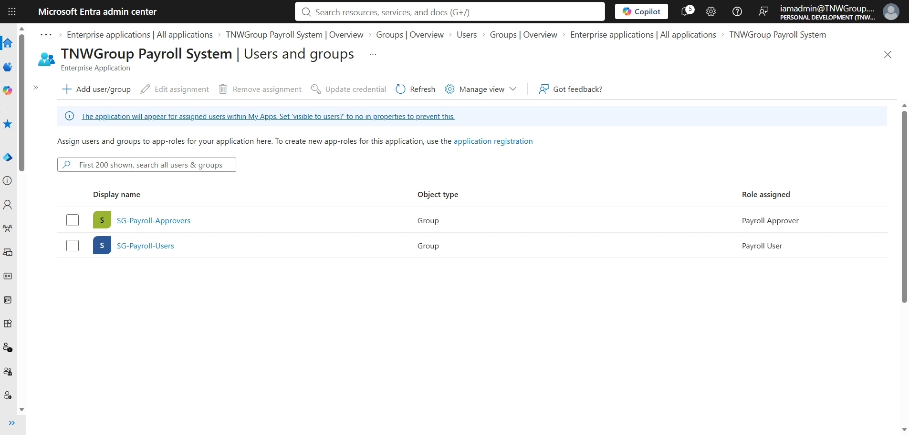

### Just-in-Time Privileged Access

Payroll approvers do not require continuously active privileged membership. Eligible users activate `SG-Payroll-Approvers` membership through PIM when approval access is required.

Bob Barker was used to validate the workflow. His eligible assignment required activation before privileged membership became active.

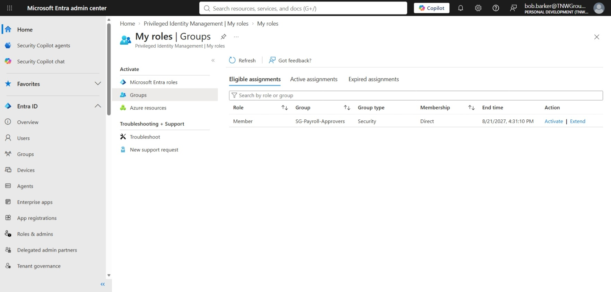

During activation, Bob requested a four-hour access window and provided a business justification for the current payroll cycle.

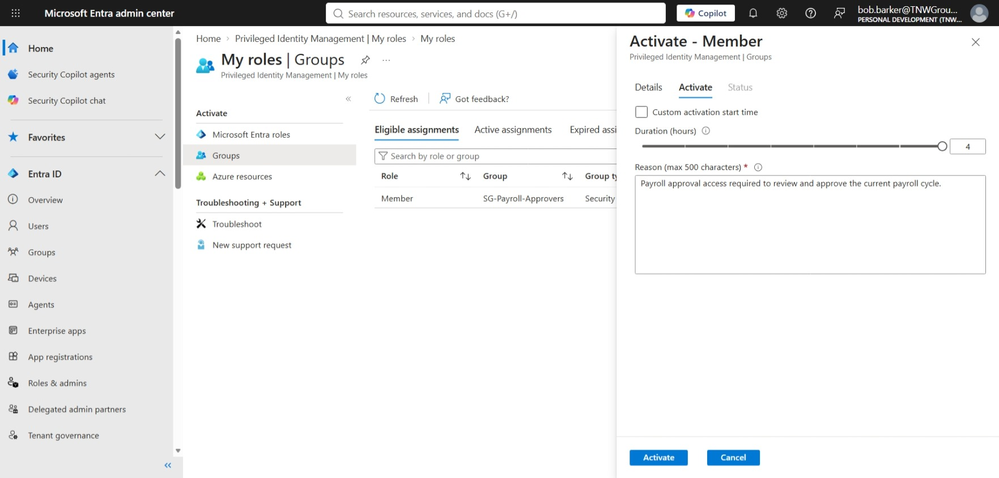

### Independent Approval and Time-Limited Access

Privileged activation required independent authorization. Casey Castigan reviewed Bob's request, the requested duration, and the business justification before approving the activation.

Casey documented a separate approval justification limiting access to the requested payroll cycle and four-hour activation window.

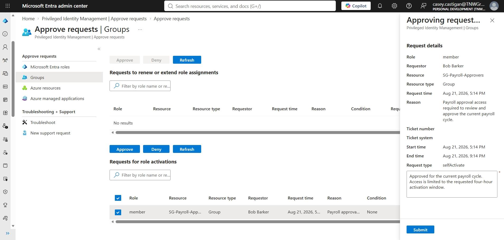

After approval, Bob's `SG-Payroll-Approvers` membership entered the **Activated** state with a defined expiration time.

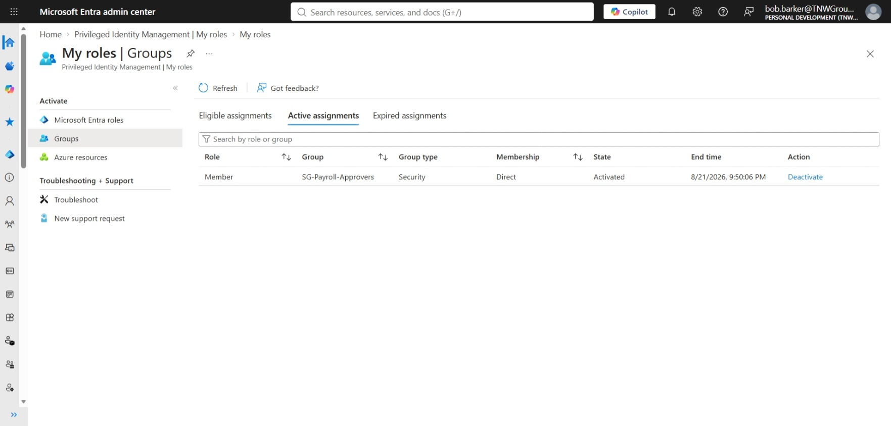

### Business Continuity Without Standing Privilege

Two employees were maintained as eligible payroll approvers:

- Bob Barker, primary payroll approver
- Anita Adams, backup payroll approver

Both remained eligible through PIM rather than continuously active members of the privileged group.

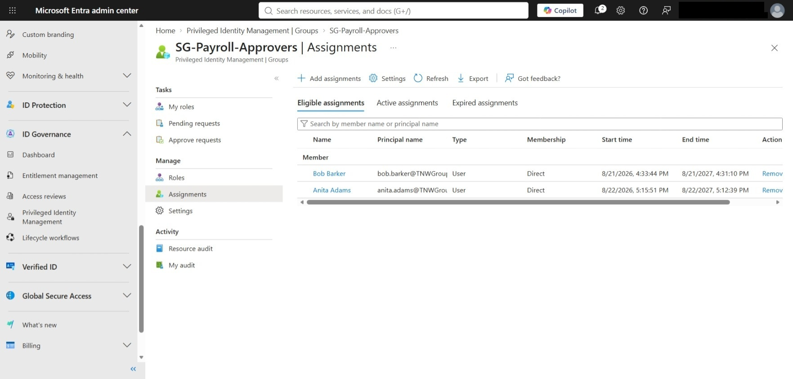

This design addresses the original single point of failure while avoiding permanent privileged access for either approver.

### Recurring Access Certification

A semi-annual access review was implemented for `SG-Payroll-Approvers`. The review requires continued evaluation of whether privileged payroll eligibility remains justified.

The review was configured with a designated reviewer, required justification, reviewer notifications and reminders, and identity activity as a decision aid.

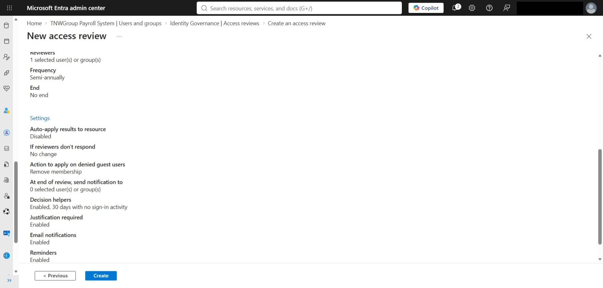

Casey Castigan performed the review as the independent business reviewer. During testing, Microsoft Entra recommended denying Anita's access because of inactivity. Casey retained Anita's eligibility and documented that she remained the designated backup payroll approver required for business continuity.

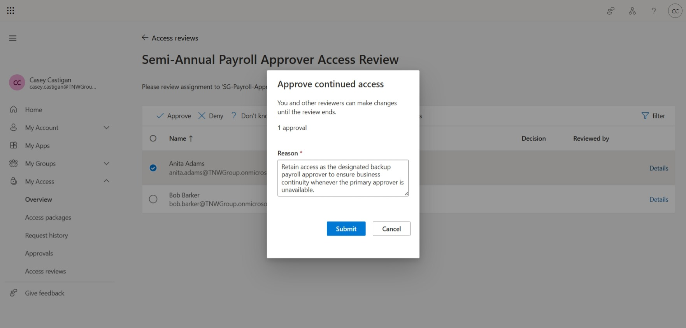

The completed review recorded approval decisions for both authorized payroll approvers.

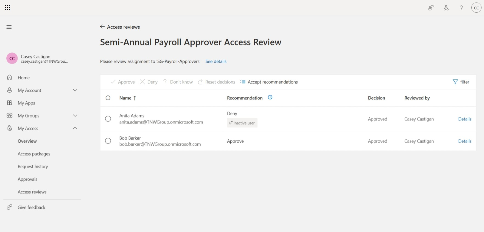

### Least-Privilege Validation

A standard payroll user was separately validated to confirm that ordinary application access did not provide privileged approval membership.

Edna Edwards remained a member of `SG-Payroll-Users` while `SG-Payroll-Approvers` was absent from her group memberships.

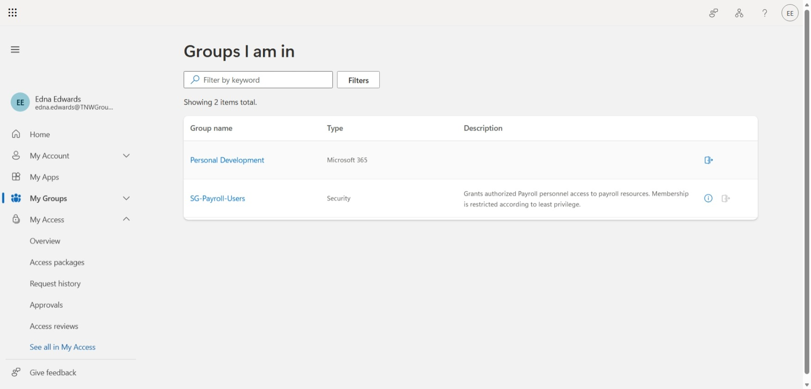

### Auditability and Automatic Privilege Removal

Microsoft Entra PIM audit records were reviewed to validate the privileged access lifecycle.

The audit trail recorded Bob's activation request, approval workflow, activation, and subsequent automatic removal from the privileged role after the approved access window ended. Administrative changes to eligible assignments were also recorded.

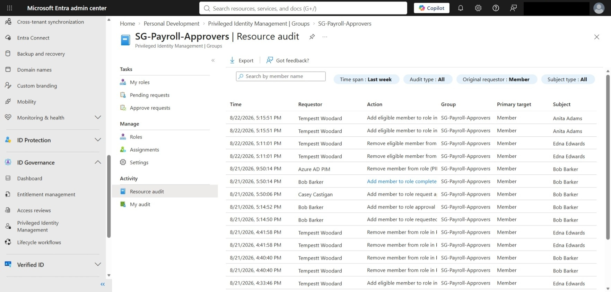

## Security Controls & Design Decisions

The lab was designed around the principle that payroll access should reflect business responsibilities while minimizing unnecessary privilege.

| Risk | Control | Implementation |
| --- | --- | --- |
| Single point of failure | Business continuity | Primary and backup payroll approvers were established |
| Excessive application access | RBAC | Payroll User and Payroll Approver application roles were assigned through separate security groups |
| Standing privileged access | PIM / JIT access | Payroll approvers were maintained as eligible rather than permanently active members |
| Unjustified privilege activation | Business justification | PIM activation requires the requester to document the business need |
| Self-approval of privileged access | Separation of duties | Payroll approver activation requires independent approval |
| Excessive activation duration | Time-bound access | Privileged membership is activated only for a limited period |
| Stale privileged eligibility | Access reviews | Payroll approver eligibility is reviewed semi-annually |
| Unaccountable review decisions | Required justification | Reviewers document the business reason for access certification decisions |
| Inappropriate privilege inheritance | Least privilege | Standard payroll users do not receive membership in the privileged approver group |
| Untraceable privileged activity | Audit logging | PIM records requests, approvals, activations, assignment changes, and automatic removal |

### Separation of Duties

The design separates three responsibilities:

1. **Payroll usage:** Standard payroll users receive application access through `SG-Payroll-Users`.
2. **Payroll approval:** Authorized approvers become temporarily active through `SG-Payroll-Approvers`.
3. **Access governance:** Casey Castigan independently approves privileged activation requests and performs recurring access certification.

This prevents an eligible payroll approver from independently granting and certifying their own privileged access.

### Least Privilege and Just-in-Time Access

Eligibility and active privilege are treated as separate states.

Bob Barker and Anita Adams may have a legitimate business need to perform payroll approval, but that need does not require continuous privileged access. PIM preserves their eligibility while requiring privileged membership to be activated only when needed.

This reduces the organization's standing privilege while preserving operational availability.

### Business Continuity

The original payroll process depended on one employee. The redesigned model establishes a primary and backup approver without permanently granting elevated access to both employees.

Bob Barker serves as the primary approver, while Anita Adams retains eligible backup access. If the primary approver is unavailable, the backup approver can use the same governed PIM activation process.

During access-review testing, Microsoft Entra recommended denying Anita's continued access because of inactivity. The reviewer retained her eligibility with documented justification because inactivity was consistent with her backup role and her continued eligibility mitigated the original business-continuity risk.

This demonstrates that automated identity signals can support access decisions, but business context remains necessary when determining whether access is appropriate.

### Governance Lifecycle

The completed design applies controls throughout the privileged access lifecycle:

`Assign Eligibility → Review Continued Need → Request Activation → Authenticate → Justify → Independently Approve → Activate Temporarily → Audit → Automatically Remove`

This provides controls both over **who is authorized for privileged payroll access** and **when that privilege may actually be exercised**.

## Results

The redesigned payroll access model addressed both the original business-continuity problem and the associated privileged-access risks.

The completed solution achieved the following outcomes:

- Established separate Payroll User and Payroll Approver roles
- Replaced direct standing payroll approval access with PIM-managed eligibility
- Established primary and backup payroll approvers
- Required time-limited activation for privileged payroll access
- Required business justification for privileged activation
- Required independent authorization of privileged activation requests
- Verified automatic removal of temporary privileged access
- Separated standard payroll users from privileged payroll approvers
- Implemented semi-annual recertification of payroll approver eligibility
- Required documented justification for access-review decisions
- Validated the privileged access lifecycle through PIM audit records

The resulting model preserves payroll availability without requiring permanent privileged access for multiple employees.

## Limitations & Production Considerations

This project was implemented in a lab tenant using fictional identities and a simulated payroll enterprise application. The focus was identity architecture and access governance rather than application functionality.

In a production environment, additional considerations would include:

- Integration with a production payroll application that enforces application roles
- Assignment of narrowly scoped administrative roles instead of relying on Global Administrator for lab administration
- Emergency or break-glass access procedures
- Formal joiner, mover, and leaver processes
- Integration with authoritative HR identity data
- Conditional Access policies based on organizational risk requirements
- Defined escalation procedures for incomplete access reviews
- Centralized monitoring and alerting for privileged identity events
- Documented ownership for groups, applications, access reviews, and privileged roles
- Periodic testing of backup approver readiness and business-continuity procedures

The lab intentionally focused on a small number of identities so that the complete privileged-access lifecycle could be configured, tested, and documented end to end.

## Skills Demonstrated

- Microsoft Entra ID administration
- Identity and Access Management (IAM)
- Role-Based Access Control (RBAC)
- Microsoft Entra Privileged Identity Management (PIM)
- Just-in-Time (JIT) privileged access
- Least-privilege design
- Separation of duties
- Enterprise application role assignment
- Security group administration
- Privileged access approval workflows
- Access reviews and access recertification
- Identity governance
- Audit-log analysis
- Business-continuity planning
- Security control validation
- Technical documentation

## Key Takeaways

This project reinforced that IAM is not simply the assignment of permissions. Effective access governance requires controls over the full access lifecycle, including who is eligible for access, when elevated access becomes active, who authorizes it, how long it remains active, whether the underlying business need still exists, and whether those decisions can be audited.

The backup payroll approver scenario also demonstrated the importance of combining identity telemetry with business context. Inactivity can be a useful indicator of stale access, but it does not automatically mean access is unnecessary. In this scenario, retaining an inactive backup approver was an intentional business-continuity decision that remained subject to least privilege, PIM activation, independent approval, and recurring review.

